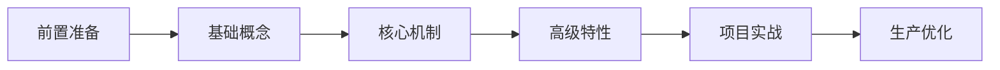

我将为你制定一个为期 **4-6 周** 的 LangGraph 系统学习计划。这个计划假设你已具备 Python 基础和基本的 LLM 知识（如了解 OpenAI API 和 LangChain 基础）。

## 🎯 学习路线图概览

---

## 📚 阶段一：前置准备（第 1 周）

### 学习目标
- 确保环境就绪
- 复习必要的 LangChain 基础
- 理解状态机和图论基础概念

### 具体任务

**Day 1-2: 环境搭建**
- 安装依赖：`pip install langgraph langchain langchain-openai langsmith`
- 配置 API Keys（OpenAI/Anthropic）
- 设置 LangSmith 用于调试跟踪

**Day 3-5: LangChain 基础复习**
- LCEL (LangChain Expression Language) 语法
- 链（Chains）与提示词模板
- 工具（Tools）和代理（Agents）基础概念

**Day 6-7: 理论准备**
- 理解**状态机（State Machine）**概念
- 阅读 LangGraph 官方文档的 "Why LangGraph?" 部分
- 观看官方介绍视频（如有）

**Checkpoint**: 能独立运行一个简单的 LangChain 链，并能在 LangSmith 看到追踪记录。

---

## 🧱 阶段二：核心概念掌握（第 2-3 周）

### 学习目标
- 掌握 StateGraph 的构建方式
- 理解节点（Nodes）和边（Edges）的概念
- 学会状态（State）的传递与修改

### Week 2: 基础架构

**Day 1-2: 第一个 Graph**
- 理解 `StateGraph` 类
- 创建简单的线性流程（A → B → C）
- 学习 `START` 和 `END` 节点
- **实践**: 构建一个"文本翻译 → 润色 → 输出"的线性管道

**Day 3-4: 条件边（Conditional Edges）**
- 学习 `add_conditional_edges`
- 理解路由逻辑（Routing）
- **实践**: 构建一个"情感分析路由器"：根据用户输入情感（正面/负面/中性）路由到不同处理节点

**Day 5-7: 状态管理（State Management）**
- 深入理解 `TypedDict` 状态定义
- 掌握状态合并（Reducer）机制
- 学习 `Command` 和状态更新模式
- **实践**: 构建一个支持"记忆"的对话机器人，能累积上下文

**Checkpoint**: 实现一个带有分支逻辑的客服对话流程，能根据用户意图跳转不同处理分支。

### Week 3: 持久化与检查点

**Day 1-3: Checkpointer 机制**
- 学习 `MemorySaver` 和持久化存储
- 理解线程（Thread）和检查点（Checkpoint）概念
- 实现对话历史的保存与恢复
- **实践**: 为之前的对话机器人添加"暂停/恢复"功能

**Day 4-5: 人机协同（Human-in-the-loop）**
- 学习 `interrupt` 和 `Command(resume=...)`
- 实现审批流程（Approval Workflows）
- **实践**: 构建一个需要人工确认才能执行敏感操作的 Agent

**Day 6-7: 时间旅行（Time Travel）**
- 学习状态回溯（Replay）
- 理解分叉（Forking）概念
- **实践**: 实现一个可以"撤销"或"修改历史"的交互式应用

---

## 🚀 阶段三：高级特性（第 4 周）

### 学习目标
- 掌握多代理系统（Multi-Agent）
- 理解流式输出（Streaming）
- 学习子图（Subgraphs）和映射（Map-Reduce）

### 具体任务

**Day 1-2: 多代理架构**
- Supervisor 模式（监督者模式）
- 去中心化协作（Agent handoffs）
- **实践**: 构建"研究助手团队"：搜索代理 → 分析代理 → 写作代理，由 Supervisor 协调

**Day 3-4: 子图（Subgraphs）**
- 模块化设计：将复杂图拆分为子图
- 父图与子图的状态传递
- **实践**: 将 Week 2 的客服系统重构为模块化子图（意图识别子图、处理子图、结算子图）

**Day 5-6: 流式与异步**
- 学习 `astream` 和 `astream_events`
- 实现打字机效果输出
- 处理长时间运行的任务
- **实践**: 为 Agent 添加实时状态显示（"正在思考..."、"正在搜索..."）

**Day 7: 高级模式**
- 并行执行（Parallel Nodes）
- Map-Reduce 模式（分批处理）
- **实践**: 实现一个能并行分析多个文档并汇总结果的 Pipeline

**Checkpoint**: 构建一个支持流式输出的多代理系统，能在 LangSmith 中清晰看到每个代理的执行轨迹。

---

## 🏗️ 阶段四：项目实战（第 5-6 周）

选择一个完整项目，整合所有知识点：

### 项目选项 A：智能研究报告生成器
**功能要求**:
- 使用 Supervisor 协调多个研究员代理
- 支持人机协同：关键数据需要人工确认
- 持久化：支持分阶段保存，可中断后继续
- 流式输出：实时显示研究进度

### 项目选项 B：企业级客服系统
**功能要求**:
- 复杂的状态管理（用户信息、订单状态、对话历史）
- 条件路由：技术支持、销售、投诉部门智能分流
- 工具调用：查询数据库、创建工单
- 人工接管：复杂问题自动转人工

### 项目选项 C：代码审查助手（Code Review Agent）
**功能要求**:
- 并行分析：风格检查、安全扫描、性能分析同时进行
- 状态持久化：保存大型代码库的审查状态
- 人机交互：对高风险修改要求确认

### 实战周安排

**Week 5: 架构与开发**
- Day 1-2: 设计状态图架构（画出 Mermaid 图）
- Day 3-5: 核心功能开发
- Day 6-7: 集成测试与调试（使用 LangSmith）

**Week 6: 优化与部署**
- Day 1-2: 错误处理与重试机制
- Day 3-4: 性能优化（异步、批处理）
- Day 5-6: 部署准备（Docker、环境变量管理）
- Day 7: 项目复盘与文档编写

---

## 📖 推荐学习资源

### 官方资源（优先级最高）
1. **LangGraph 官方文档**: https://langchain-ai.github.io/langgraph/
   - 重点教程：Agentic RAG、Multi-Agent、Human-in-the-loop
2. **LangGraph 概念指南**: 深入理解 State、Checkpoint、Persistence
3. **官方 GitHub Examples**: https://github.com/langchain-ai/langgraph/tree/main/examples

### 视频与课程
- **LangChain 官方 YouTube**: 搜索 "LangGraph" 标签的最新视频
- **DeepLearning.AI 课程**: 如果有相关短课程（吴恩达团队经常与 LangChain 合作）

### 社区与实战
- **LangChain 官方 Discord**: #langgraph 频道
- **GitHub 优秀项目**:
  - `langgraph-studio`: 可视化调试工具（必须掌握）
  - 各种 Agent 框架的对比实现

### 工具链
- **LangSmith**: 用于调试和观察 Graph 执行流程（必备）
- **LangGraph Studio**: 桌面可视化工具，可实时查看状态流转

---

## ✅ 学习检查清单

完成以下任务即视为掌握 LangGraph：

- [ ] 能独立画出复杂 Agent 系统的状态图（使用 Mermaid 或纸笔）
- [ ] 实现一个带持久化的对话系统，支持"回到过去"修改历史
- [ ] 构建包含至少 3 个 Agent 的多代理系统，使用 Supervisor 模式
- [ ] 成功处理一次人机协同流程（interrupt → 人工输入 → resume）
- [ ] 使用 LangSmith 成功追踪并调试一个失败的 Graph 执行
- [ ] 将应用部署到本地或云端，能持续运行不丢失状态

---

## 💡 学习建议

1. **先画图，后编码**: LangGraph 是状态机，先用 Mermaid 或 Excalidraw 画出节点和边，再写代码
2. **善用 LangSmith**: 打开 `process.env["LANGCHAIN_TRACING_V2"] = "true"`，所有执行都会可视化，调试效率提升 10 倍
3. **从简单线性开始**: 不要一开始就做复杂的循环和条件，先确保线性 Graph 能跑通
4. **注意状态类型**: Python 的类型提示（TypedDict）在 LangGraph 中不仅是提示，更是运行时契约
5. **参考官方 Patterns**: LangGraph 官方仓库的 `examples` 目录有大量经过验证的设计模式（RAG、Agent、Plan-and-Execute 等）

需要我针对某个特定阶段（如 Multi-Agent 或 Human-in-the-loop）制定更详细的子计划吗？或者你有特定的应用场景（如 RAG、代码生成），我可以调整计划重点。